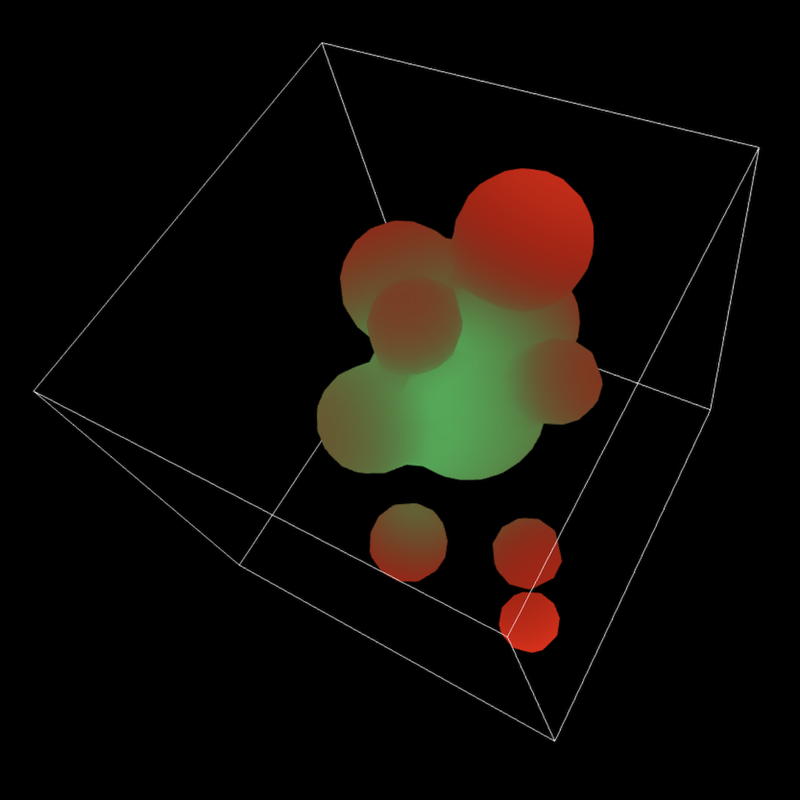
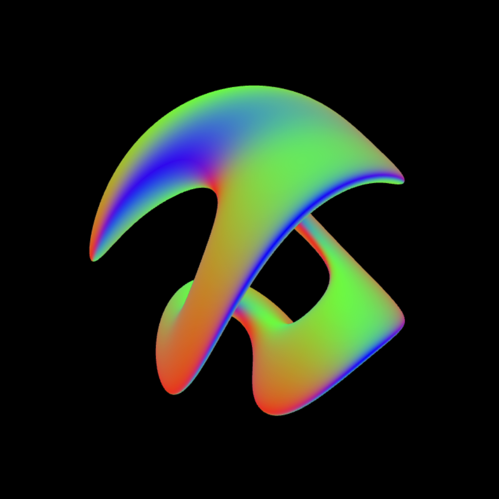
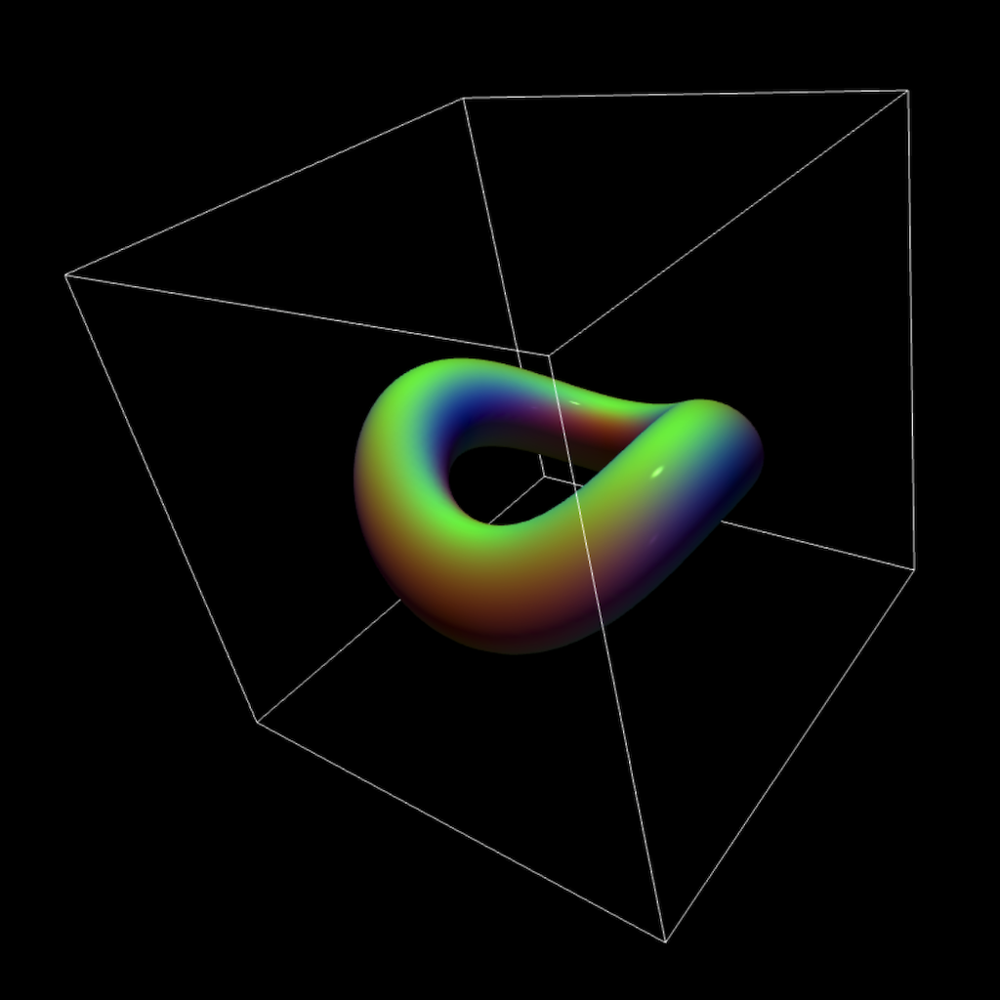

an implementation of [marching cubes](https://en.wikipedia.org/wiki/Marching_cubes) to render [metaballs](https://en.wikipedia.org/wiki/Metaballs) and procedurally defined 3d shapes

## marching-cubes-optimized-metaballs-webgl

3d, renders a metaball animation with webgl
some parameters for animation/viewing/marching can be tweaked

## marching-cubes-optimized-webgl

3d, renders a procedurally-defined shapes
some parameters for animation/viewing/marching can be tweaked

## marching-cubes-webgl

essentially the same result as `marching-cubes-optimized-webgl`
don't recall off the top of my head how it differs from `marching-cubes-optimized-webgl`
might have something to do with 3d geometry setup or indexing